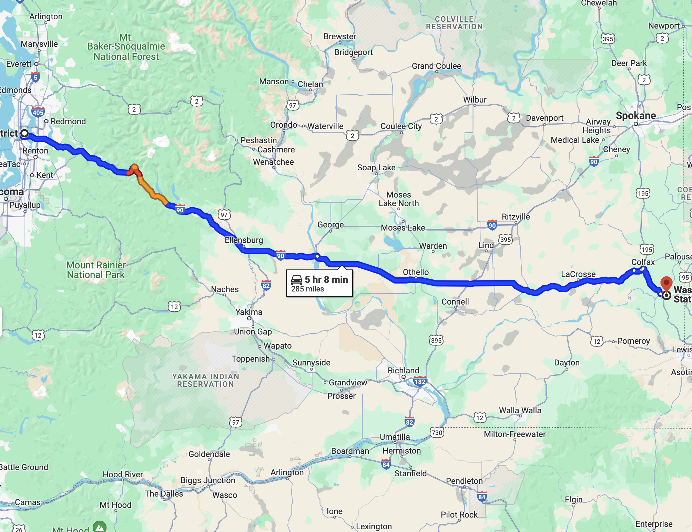
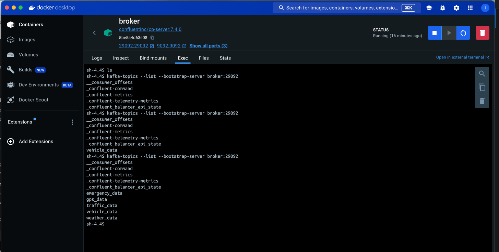

# Data Engineering with Traffic Data

In this data engineering project, we will be working with traffic data from the city of Seattle. The data is dummy, hence generated but with close to the reality data found and generated in smart cities. Usually, The data is collected by the city's traffic management system and includes information about traffic flow, traffic speed, and traffic volume. The data is collected from various sensors and cameras installed throughout the city.

Our dataset will include the following data sources:



- Vehicle data
- GPS data
- Camera data
- Weather data
- Emergency data


As seen, in the architecture diagram, the data is collected from various sources and is then ingested into Kafka which leverages the zookeeper for distributed coordination. The data is then processed using Spark and stored in Amazon S3.
From here, we leverage amazon data tech stack to store the data in a data lake and then use AWS Glue to catalog the data through crawlers and make it available for querying using Amazon Athena and Amazon Redshift.

The data is then used to generate reports and dashboards using PowerBI, Tableau and Looker Studio.

## Getting Started

Once published, you can check if kafka is receiving the topics by running the following command:

```bash
docker exec -it broker kafka-console-consumer --bootstrap-server localhost:9092 --topic traffic_data --from-beginning
```

or get inside the kafka container using the desktop client and run the following command:

```bash
kafka-topics --list --bootstrap-server broker:29092
```



<!--  -->

The exponential decay formula \(a \cdot e^{(-b \cdot t)} + c\) mathematically models processes where something decreases at a rate proportional to its current value, adding a constant \(c\) to adjust the final value. This is often used to describe natural phenomena such as radioactive decay, cooling processes, or, in our context, simulating acceleration and deceleration where the change happens rapidly initially and then slows down.

Here's a breakdown of the formula components:

- \(a\): The initial amount minus the final value you're approaching. It determines the starting point of the decay process before adding the constant \(c\).
- \(e\): The base of natural logarithms, approximately equal to 2.71828. It's a constant used in many areas of mathematics, especially in calculus and exponential growth/decay functions.
- \(-b\): The decay rate. A higher \(b\) value means a faster decay towards the target value. The negative sign indicates that the process is a decay (reduction over time) rather than growth.
- \(t\): Time. The variable representing time in the same units that \(b\) is defined. As \(t\) increases, \(a \cdot e^{(-b \cdot t)}\) decreases.
- \(c\): The offset constant. This is the value that the decaying quantity will approach over time. Adding \(c\) shifts the entire decay curve up by \(c\) units.

To put this into a mathematical representation:

\[
y(t) = a \cdot e^{(-b \cdot t)} + c
\]

Where:

- \(y(t)\) is the value at time \(t\),
- \(a\) is the difference between the initial value and the final value \(c\),
- \(b\) is the decay rate,
- \(t\) is the time, and
- \(c\) is the final value the function approaches as \(t\) goes to infinity.

This formula gives us a way to simulate how a system that rapidly changes at first might slow its rate of change over time, eventually stabilizing at a constant value \(c\).
